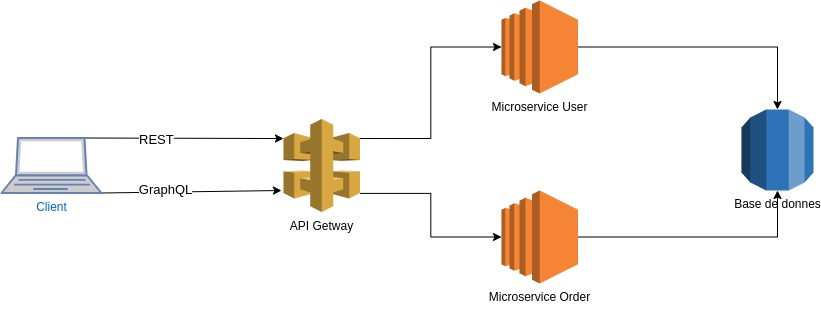

# microservice_project

this project is a simple skeleton code for microservice architecture pattern using nodejs , postgres , prisma , Rest , GraphQL
Thanks to MR Gontara Salah which has inspired and given really good knowledge for setting up this project.




# Technologies
gRPC: Used for efficient communication between microservices.


GraphQL: Implemented for flexible and efficient querying of data.


REST: RESTful APIs are used for exposing the services to external clients.


# USER MICROSERVICE

Contains API related to creating A new USER and API end point to get this USER

Rest :


```http
  GET /users

```
GraphQL :


```graphql
query {
   users {
    id
    name
    prenom
  }
}
```

Rest :


```http
  POST /user
```

| Parameter   | Type     | Description                       |
| :-----------| :------- | :-------------------------------- |
| `name`      | `string` | **Required**.                     |
| `prenom`    | `string` | **Required**.                     |

GraphQL :

```graphql
mutation Mutation($name: String!, $prenom: String!) {
  createUser(name: $name, prenom: $prenom) {
    id
    name
    prenom
  }
}

variable 
{
  "name": "test",
  "prenom": "test"
}

```

# ORDER MICROSERVICE

Contains API related to creating A new ORDER and API end point to get this ORDER


Rest :


```http
  GET /orders
```

GraphQL :


```graphql
query {
   orders {
    id
    name
    description
  }
}
```
Rest :


```http
  POST /orders
```

| Parameter        | Type     | Description                       |
| :----------------| :------- | :-------------------------------- |
| `name`           | `string` | **Required**.                     |
| `description`    | `string` | **Required**.                     |


GraphQL :


```graphql
mutation Mutation($name: String!, $description: String!) {
  createOrder(name: $name, description: $description) {
    id
    name
    description
  }
}

}

variable 
{
  "name": "test",
  "description": "test"
}
```

# Requirements

Ensure you have the following software installed on your local machine:

git

Node.js (version 12 or higher)

npm (version 6 or higher)

postgres

# Common setup

Clone the repo and install the dependencies.

git clone https://github.com/sofiene-chouchen/microservice_project.git

`cd microserviceProject`

`npm install`

# Run

To start the ApiGateway server, run the following

`node apiGerway.js`

To start the User server, run the following

`cd userMicroservice`

`node userMicroservice.js`

To start the Order server, run the following

`cd orderMicroservice`

`node orderMicroservice.js`
